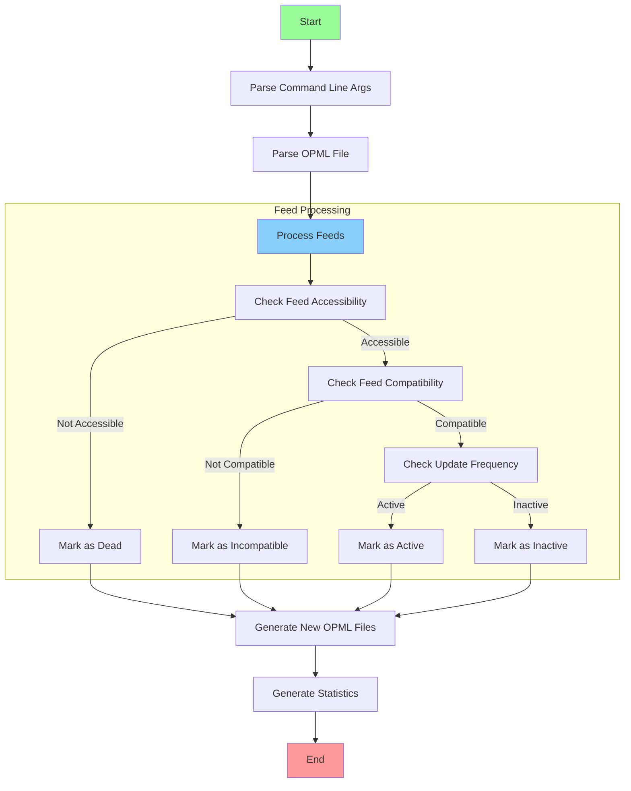

# OPML Feed Validator Process Flow

This diagram illustrates the main process flow of the OPML feed validator and analyzer, showing how feeds are processed, validated, and categorized before generating the final output files.
